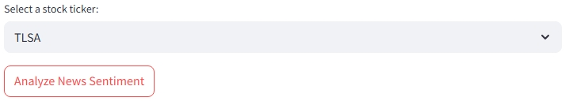
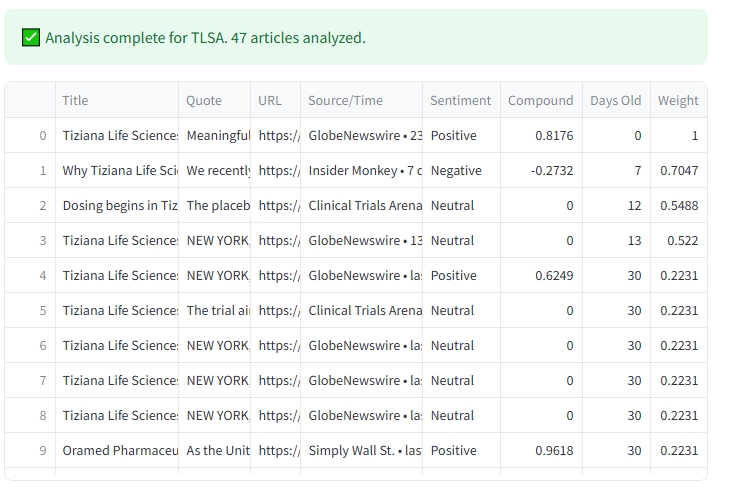
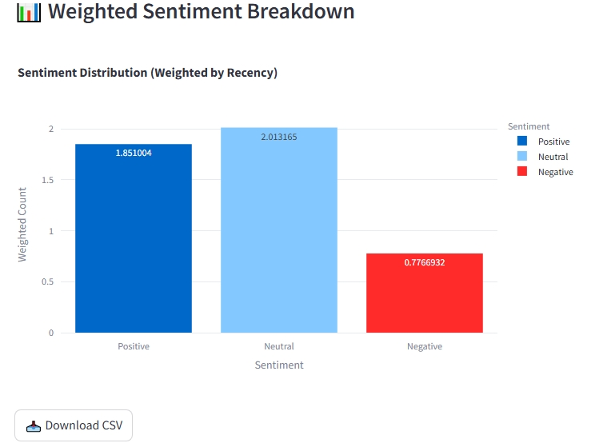

# 📈 Stock News Sentiment Analyzer (Yahoo Finance + VADER)

This is a lightweight, user-friendly Streamlit app that allows users to:

* 🔍 Search and select any US stock ticker from a list.
* 📰 Scrape the latest news headlines and summaries from Yahoo Finance.
* 💬 Analyze the sentiment of each article using the VADER sentiment analyzer.
* 🕒 Apply **time-decay weighting** to emphasize more recent news.
* 📊 Visualize weighted sentiment distribution.
* 💾 Export results to CSV.





---

## 🚀 Features

* ✅ Select from 5,000+ listed tickers (NASDAQ, NYSE).
* ✅ Integrated VADER sentiment scoring.
* ✅ Automatically handles cookie popups and loads more news via scrolling.
* ✅ Applies **exponential decay** based on news age.
* ✅ Modern, beautiful charts with Plotly.
* ✅ Fully local and private (no APIs required).

---

## 🛠 Requirements

* Python 3.10+
* [Google Chrome](https://www.google.com/chrome/)
* [Playwright (headless browser automation)](https://playwright.dev/python/)

### Install dependencies

```bash
pip install -r requirements.txt
playwright install
```

**requirements.txt**

```txt
streamlit
pandas
plotly
playwright
vaderSentiment
```

---

## 📂 File Structure

```bash
📁 Sentiment news yahoo
├── main.py                  # Streamlit front-end & backend logic
├── allsymbols.txt           # List of stock symbols (used in dropdown)
├── README.md                # This file
├── chart.jpeg               # Screenshot for README
├── table.jpeg               # Screenshot for README
├── search.jpeg              # Screenshot for README
```

---

## 🧠 How It Works

1. User selects a ticker (e.g., `TSLA`).
2. The app opens the related Yahoo Finance News page in a headless browser via **Playwright**.
3. News articles (title, quote, time) are extracted dynamically.
4. Each article is analyzed by **VADER** to determine polarity.
5. Sentiment weights are applied using:

   $$
   \text{weight} = e^{-\lambda \cdot \text{days\_old}},\ \lambda = 0.05
   $$
6. Results are shown in a table and a bar chart.
7. Users can download a `.csv` of the analysis.

---

## 📦 To Run the App

```bash
streamlit run main.py
```

---

## 📌 Future Enhancements

* [ ] Add FinBERT for deeper financial sentiment analysis.
* [ ] Filter by date range (e.g., last 7 days).
* [ ] Add article-level confidence scoring.
* [ ] Support multi-ticker comparison.

---

## 📄 License

MIT License. Feel free to fork and modify.

---

Would you like me to generate a `requirements.txt` file automatically for you too?
